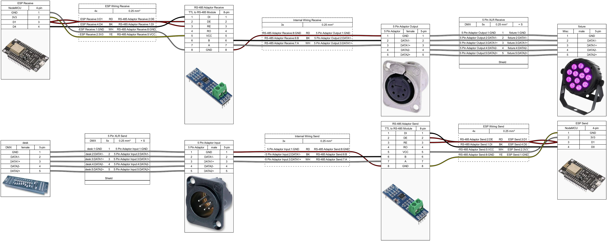

# Wireless DMX Adaptor

A wireless DMX512 adapter design using ESP8266 NodeMCU modules and RS-485 converters to enable wireless DMX transmission between lighting consoles and fixtures.



## Overview

This project provides specifications for building a wireless DMX adapter system using Art-Net protocol over WiFi.

### System Architecture

- **Transmitter Unit** ([wirelessdmx_transmitter.ino](wirelessdmx_transmitter.ino)): Reads DMX512 from a lighting desk via an RS-485 adaptor and broadcasts Art-Net packets over WiFi
- **Receiver Unit** ([wirelessdmx_receiver.ino](wirelessdmx_receiver.ino)): Receives Art-Net packets over WiFi and outputs DMX512 to fixtures via an RS-485 adaptor

Both units feature:
- **WiFi captive portal** for easy configuration without hardcoded credentials
- **Configurable Art-Net universe** (0-32767)
- **HTTP callback** to report device IP address on connection
- **Persistent EEPROM storage** for all settings

## Components

### Transmitter Side
- 5-Pin XLR Male Panel Adapter
- TTL to RS-485 Module
- NodeMCU ESP8266 Module

### Receiver Side
- NodeMCU ESP8266 Module
- TTL to RS-485 Module
- 5-Pin XLR Female Panel Adapter

## Wiring Specifications

The wiring diagram was created using [WireViz](https://github.com/formatc1702/WireViz), an open-source tool for documenting cable assemblies.

To regenerate the diagram from the YAML source:
```bash
wireviz wirelessdmx.yaml
```

## Firmware

### Required Libraries

Install these libraries via the Arduino Library Manager:
- **ESP8266WiFi** (included with ESP8266 core)
- **WiFiManager** by tzapu
- **ArtnetWifi**
- **ESPDMX**
- **ESP8266HTTPClient** (included with ESP8266 core)

### Configuration

On first boot, each device creates a WiFi access point:
- **Transmitter**: `DMX_TX_Setup`
- **Receiver**: `DMX_RX_Setup`

Connect to the AP and configure:
- **WiFi credentials** (saved for future connections)
- **Art-Net Universe** (must match on transmitter and receiver)
- **Callback URL** (optional, receives GET request with `?ip=` parameter on connection)
- **Target IP** (transmitter only, default: 255.255.255.255 broadcast)

### Pin Assignments

Both devices use:
- **D1 (GPIO5)**: RS-485 direction control (DE/RE pins)
- **D4 (GPIO2)**: Transmit DMX data (receiver only)
- **D0 (GPIO3)**: Receive DMX data (transmitter only)

## Building

### Hardware

## License

See [LICENSE](LICENSE) for details.


